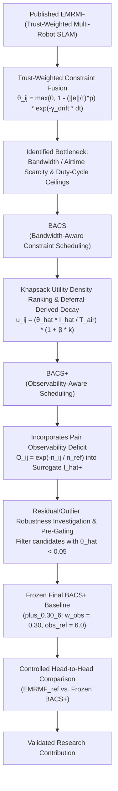
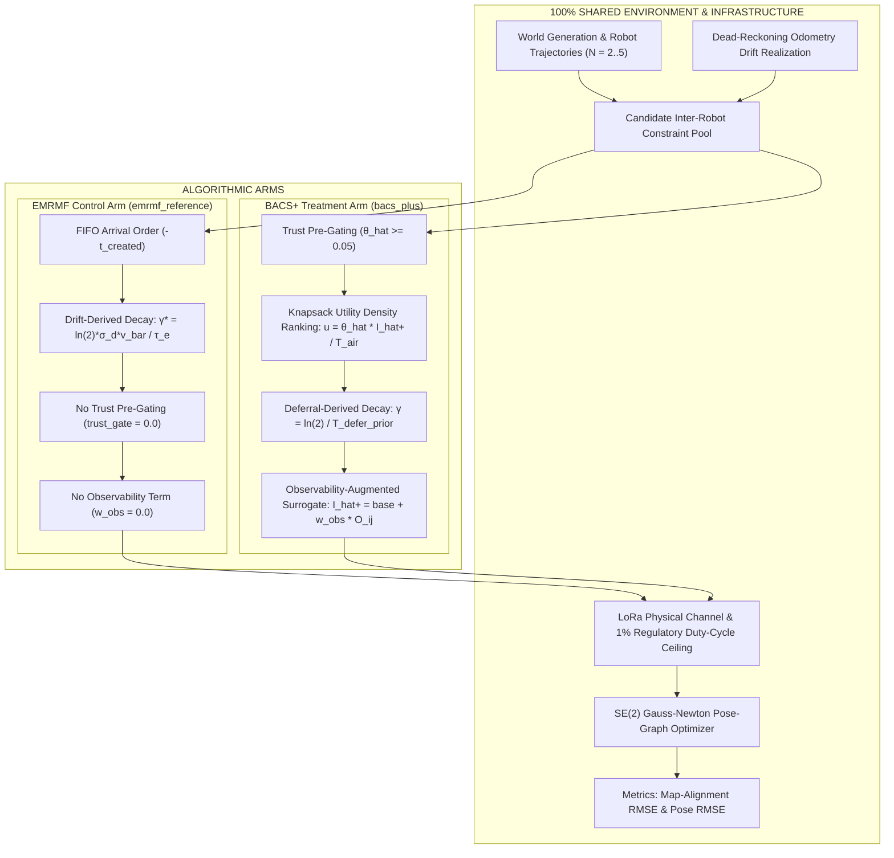

# EMRMF to BACS / BACS+ Algorithm & Architectural Crosswalk

## 1. Executive Summary & Scientific Rationale

This document establishes a rigorous, scientifically defensible crosswalk between the antecedent published framework **EMRMF** (*Extended Multi-Robot Map Fusion*) and its direct successors, **BACS** (*Bandwidth-Aware Constraint Scheduling*) and **BACS+** (*Observability- and Bandwidth-Aware Constraint Scheduling*).

The primary objective of this crosswalk is to enable a **controlled head-to-head evaluation** comparing published EMRMF against the frozen BACS+ baseline under an identical simulated environment. In published work, EMRMF and BACS+ were evaluated under different simulation parameters, random seeds, channel implementations, and evaluation pipelines. Directly comparing previously published scalar RMSE values (e.g., EMRMF 0.287 m vs. BACS+ 0.257 m) is scientifically invalid.

To address this, we define an **EMRMF reference arm** (`emrmf_reference`) inside the unified BACS simulation engine. This control arm reproduces EMRMF's decision rules (FIFO arrival transmission, drift-derived temporal trust decay, un-gated candidate selection) while sharing 100% of the world generation, odometry drift realizations, candidate constraint pools, physical LoRa channel dynamics, pose-graph optimizer, and map-alignment evaluation metrics with BACS+.

---

## 2. Research Progression & Evolutionary Flowcharts

### 2.1 High-Level Scientific Evolution



```
[Published EMRMF]
       │
       ▼
[Trust-Weighted Constraint Fusion (Spatial Residual + Temporal Drift Decay)]
       │
       ▼
[Identified Bottleneck: Scalability drop under strict LoRa 1% Duty-Cycle ceiling]
       │
       ▼
[BACS: Bandwidth-Aware Knapsack Utility Density Scheduling & Deferral Decay]
       │
       ▼
[BACS+: Observability Deficit Term O_ij = exp(-n_ij / n_ref)]
       │
       ▼
[Residual / Outlier Pre-Gating (θ_hat >= 0.05)]
       │
       ▼
[Frozen Final BACS+ Configuration (plus_0.30_6)]
       │
       ▼
[Fresh-Seed Controlled Paired Comparison (EMRMF_ref vs BACS+)]
       │
       ▼
[Final Scientifically Defensible Progression Contribution]
```

---

### 2.2 Method-Level Architectural Flow Diagram



---

## 3. Comprehensive Crosswalk Table

| Component / Feature | Published EMRMF | BACS (Intermediate) | BACS+ (Final Frozen) | Controlled `emrmf_reference` Implementation | Controlled `bacs_plus` Implementation |
| :--- | :--- | :--- | :--- | :--- | :--- |
| **Local SLAM / Odometry** | 2D LiDAR + Odom dead reckoning | Simulated SE(2) odometry with linear/RW drift | Simulated SE(2) odometry with linear/RW drift | Shared `build_world()` ground truth & odometry drift | Shared `build_world()` ground truth & odometry drift |
| **Constraint Generation** | Range-gated candidate features | Spatial overlap candidate generator (`obs_radius=3.0m`) | Spatial overlap candidate generator (`obs_radius=3.0m`) | Shared `precompute()` candidate pool | Shared `precompute()` candidate pool |
| **Trust Spatial Term** | $\max(0, 1 - (\|e\|/\tau_e)^p)$ with $\tau_e=0.5\text{m}, p=3$ | $\max(0, 1 - (\|e\|/\tau_e)^p)$ with $\tau_e=0.5\text{m}, p=3$ | $\max(0, 1 - (\|e\|/\tau_e)^p)$ with $\tau_e=0.5\text{m}, p=3$ | $\max(0, 1 - (\|e\|/\tau_e)^p)$ with $\tau_e=0.5\text{m}, p=3$ | $\max(0, 1 - (\|e\|/\tau_e)^p)$ with $\tau_e=0.5\text{m}, p=3$ |
| **Trust Temporal Term** | $\exp(-\gamma \cdot dt)$ with drift-derived $\gamma^*$ | $\exp(-\gamma \cdot dt)$ with deferral-derived $\gamma$ | $\exp(-\gamma \cdot dt)$ with deferral-derived $\gamma$ | $\gamma^* = \ln 2 \cdot \sigma_d \cdot \bar{v} / \tau_e \approx 0.033$ | $\gamma = \ln 2 / T_{\text{defer}} \approx 0.0045$ |
| **Trust Floor** | $\text{floor} = 0.01$ | $\text{floor} = 0.01$ | $\text{floor} = 0.01$ | $0.01$ | $0.01$ |
| **Trust Prediction** | $\hat{\theta}_{ij}$ without deferral delay | $\hat{\theta}_{ij}$ with predicted deferral delay $\Delta \hat{t}$ | $\hat{\theta}_{ij}$ with predicted deferral delay $\Delta \hat{t}$ | $\hat{\theta}_{ij}$ with predicted delay | $\hat{\theta}_{ij}$ with predicted delay |
| **Information Surrogate** | None / unweighted | Novelty + degree + loop length ($\hat{I}$) | Observability-augmented $\hat{I}_+ = \hat{I} + w_{\text{obs}} O_{ij}$ | None used for ranking | Active ($\hat{I}_+$, $w_{\text{obs}}=0.30$, $n_{\text{ref}}=6.0$) |
| **Observability Deficit** | None | None | $O_{ij} = \exp(-n_{ij} / n_{\text{ref}})$ | $0.0$ | Active ($O_{ij} = \exp(-n_{ij} / 6.0)$) |
| **Transmission Ranking** | FIFO (arrival order) | Knapsack greedy density ($\hat{\theta}\hat{I} / T_{\text{air}}$) | Gated density ranking ($\hat{I}_+ / T_{\text{air}}$) | Oldest first (`-c.t_created`) | Gated density ranking (`-c.info_hat / T_air`) |
| **Trust Pre-Gating** | None ($0.0$) | Optional | Active ($\hat{\theta}_{ij} \ge 0.05$) | $0.0$ (no gating) | $0.05$ (active gating) |
| **Wireless Channel Model** | Unrestricted / ideal or simple loss | LoRa EU868 1% duty-cycle ceiling + channel models | LoRa EU868 1% duty-cycle ceiling + channel models | Shared LoRa Channel & 1% duty cycle | Shared LoRa Channel & 1% duty cycle |
| **Pose-Graph Optimizer** | g2o SE(2) Gauss-Newton | Sparse SE(2) Gauss-Newton | Sparse SE(2) Gauss-Newton | Shared SE(2) Gauss-Newton (`PoseGraph`) | Shared SE(2) Gauss-Newton (`PoseGraph`) |
| **Map Alignment Metric** | Co-location overlap RMSE | Map-alignment RMSE vs GT co-location | Map-alignment RMSE vs GT co-location | Shared `align_rmse` implementation | Shared `align_rmse` implementation |

---

## 4. Classification of Methodological Components

### Category A: Functionality Inherited from EMRMF
- **SE(2) Pose-Graph Formulation**: Optimization of relative pose constraints using weighted Gauss-Newton solvers.
- **Trust Equation Core**: Spatial residual weighting $1 - (\|e\|/\tau_e)^p$ combined with exponential temporal decay $\exp(-\gamma \cdot dt)$.
- **Server Trust Weighting**: Scaling edge information matrices $\Omega_{ij}$ by $\theta_{ij}$ before global graph optimization.
- **Evaluation Metrics**: Map-alignment RMSE (inter-robot map disagreement on ground-truth overlap regions) and per-step pose RMSE.

### Category B: Functionality Introduced by BACS
- **Duty-Cycle & Airtime Accounting**: Explicit modeling of LoRa physical-layer airtime ($T_{\text{air}}$) and regulatory duty-cycle ceilings (1% EU868 sub-band constraint).
- **Deferral Delay Modeling**: Incorporating queue deferral windows into delay prediction $\Delta \hat{t}$, preventing gross underestimation of packet age.
- **Deferral-Derived Decay Coefficient**: Calibration of $\gamma$ to the airtime queueing timescale ($\gamma = \ln 2 / T_{\text{defer}}$) rather than local odometry drift ($\gamma^*$).
- **Knapsack Utility Density Ranking**: Ranking candidate constraints by utility density $u_{ij} = \hat{\theta}_{ij} \hat{I}_{ij} / T_{\text{air}}$ with single-item guard and age multiplier.

### Category C: Functionality Introduced by BACS+
- **Pair Observability Deficit ($O_{ij}$)**: Tracking delivered constraint count per robot pair $n_{ij}$ and computing $O_{ij} = \exp(-n_{ij} / n_{\text{ref}})$.
- **Observability-Augmented Surrogate ($\hat{I}_+$)**: Adding $w_{\text{obs}} O_{ij}$ to the information surrogate to prevent airtime starvation between under-constrained robot pairs.

### Category D: Later Residual-Gate / Final-Confirm Additions
- **Trust Pre-Gating ($\hat{\theta}_{ij} \ge 0.05$)**: Filtering out candidates whose predicted trust falls below 0.05 prior to information ranking, preventing low-trust self-confirming loops.
- **Frozen Protocol & Seed Isolation**: Standardized seed ranges (e.g., 70–99) and channel condition definitions (C0–C3) for unbiased head-to-head evaluation.

---

## 5. Controlled Bridge Implementation Details & Assumptions

1. **Shared Candidate Generator**: `emrmf_reference` and `bacs_plus` consume identical precomputed `Constraint` objects generated by `generate_candidates()`.
2. **Channel Realization**: Packet drops, retries, and propagation delays follow identical random seeds and channel models.
3. **Optimiser Parity**: Both arms pass delivered constraints to the identical SE(2) Gauss-Newton pose-graph optimizer (`PoseGraph.optimize()`).
4. **No Synthetic RMSE Formulas**: Old EMRMF synthetic `MODE_FACTORS` and heuristic RMSE formulas from legacy validation scripts are **strictly excluded**. All error metrics are computed directly by the BACS simulation pose-graph back-end.
